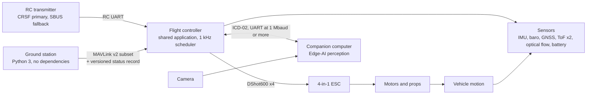
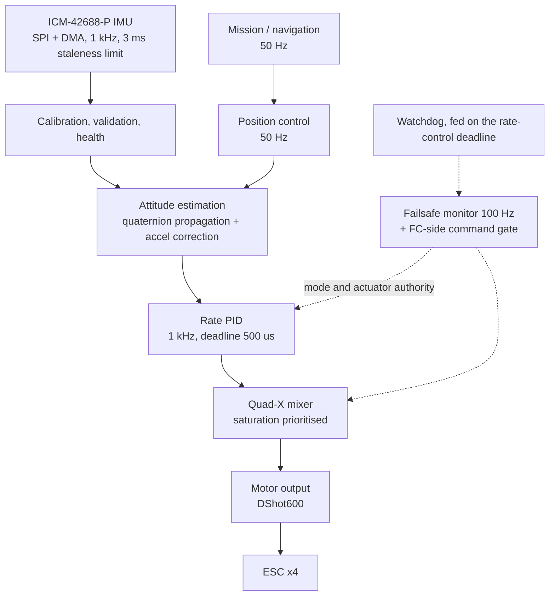
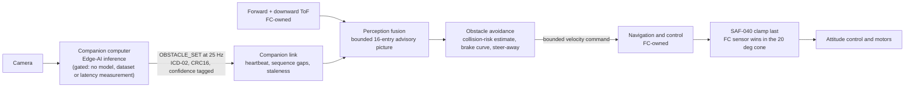
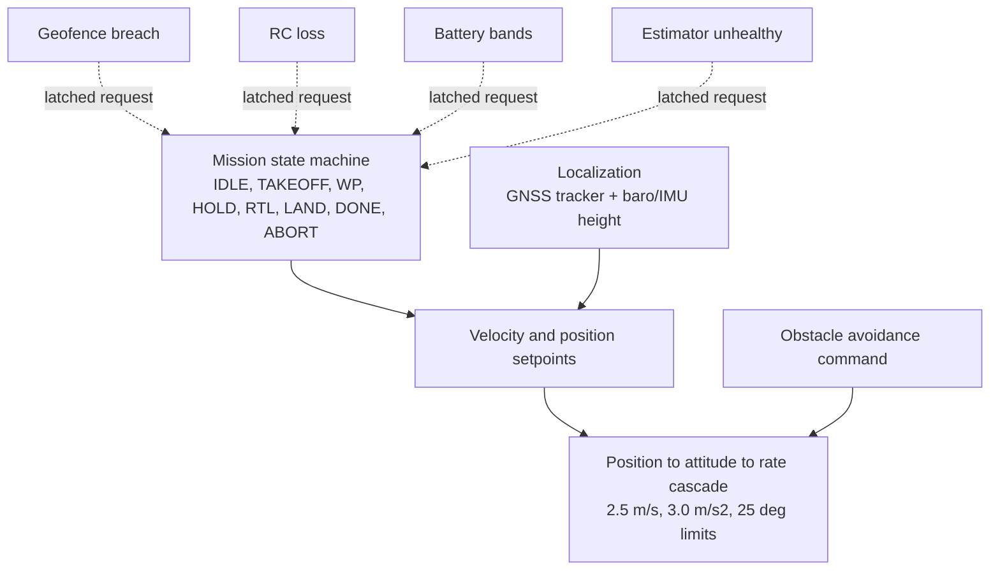
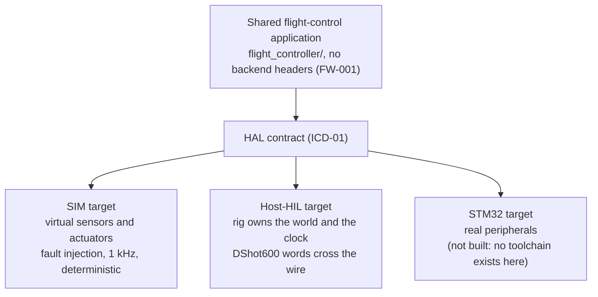
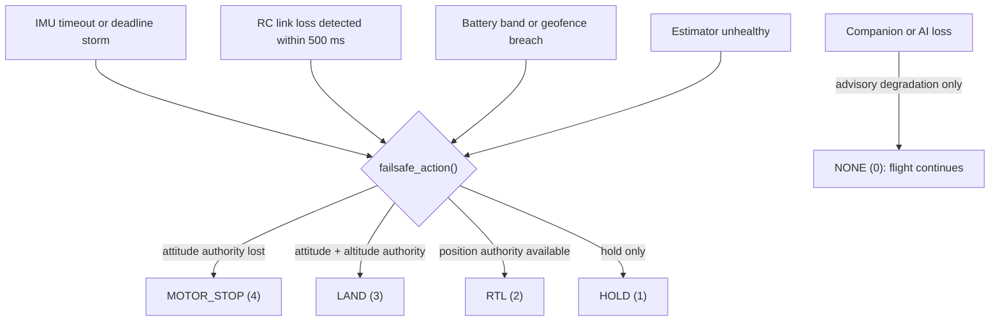
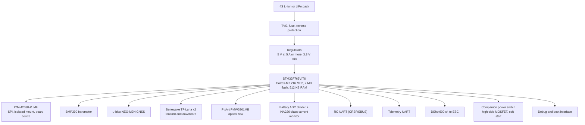

# Autonomous Drone Flight Controller + Edge-AI Obstacle Avoidance

**A complete flight-control stack for a quadcopter, built from the requirements up: custom STM32
flight-control firmware, multi-sensor fusion, autonomous waypoint navigation with failsafe logic,
a companion-computer perception interface, a ground station, and a simulation/HIL path that lets the
same control code be developed and verified before any board exists.**

[](#validation-architecture)
[](#verification-and-testing)
[](#verification-and-testing)
[](#project-status)
[](13_release/RELEASE_NOTES.md)
[](11_documentation/DOCUMENTATION_INDEX.md)

| | |
|---|---|
| **Project type** | Autonomous UAV · embedded systems · robotics · edge AI |
| **Core platform** | STM32F765VIT6 (Cortex-M7, 216 MHz) — production target; SIM target for hardware-free work |
| **Control** | 1 kHz rate loop, 250 Hz attitude loop, quad-X mixer, DShot600 output, failsafe action layer |
| **Perception** | Companion-computer Edge-AI + FC range sensors, fused into a bounded advisory obstacle picture |
| **Navigation** | Mission state machine, GNSS/baro/IMU localization, geofence, RTL/LAND/ABORT paths |
| **Validation** | Unit → SIL → fault scenarios → host HIL → STM32 bench → motor-off → controlled flight |
| **Honest status** | Software half complete and machine-audited; hardware half explicitly gated — see [Project Status](#project-status) |

> **What is real here:** everything measurable on a host — firmware algorithms, the SIM and host-HIL
> targets, 2741 test checks, 8 fault scenarios, the ground station, the audits, the documentation.
> **What is not:** any STM32 firmware image, PCB, AI model, flight test or certification. This
> repository says so in its own gates and re-checks that claim on every run.

## Contents

- [Why This Project](#why-this-project)
- [System Overview](#system-overview)
- [Flight Control Stack](#flight-control-stack)
- [Edge-AI Perception and Avoidance](#edge-ai-perception-and-avoidance)
- [Autonomous Navigation](#autonomous-navigation)
- [Dual-Target Architecture: SIM and STM32](#dual-target-architecture-sim-and-stm32)
- [Safety and Failsafe](#safety-and-failsafe)
- [Hardware Architecture](#hardware-architecture)
- [Validation Architecture](#validation-architecture)
- [Verification and Testing](#verification-and-testing)
- [Project Status](#project-status)
- [Roadmap](#roadmap)
- [Repository Structure](#repository-structure)
- [Technology Stack](#technology-stack)
- [Quick Start](#quick-start)
- [Development Workflow](#development-workflow)
- [Documentation](#documentation)
- [Engineering Principles](#engineering-principles)
- [Safety Notice](#safety-notice)
- [Contributing](#contributing)
- [License](#license)

## Why This Project

Most drone projects integrate an existing autopilot. This one builds the flight stack itself, in the
order a governed engineering project builds it: requirements with acceptance criteria → architecture
with a frozen interface set → component selection against datasheets → firmware → simulation → fault
analysis → verification → manufacturing and release records.

- **Control authority stays on the MCU.** Attitude, altitude, position control, arming, the failsafe
  layer and the motor outputs are owned by the flight controller. The companion computer publishes
  bounded, timestamped, confidence-tagged perception — it never commands motors
  (`DEC-007`, `SAF-040`/`SAF-041`).
- **Simulation is not a toy here.** `SIM` and `HIL` are real targets of the same application behind a
  HAL contract, so the control code, its timing, its determinism and its fault behaviour are exercised
  without a board — and the missing hardware is recorded as a gate rather than a gap in prose.
- **Defects were fixed at cause, not routed around.** 22 firmware/test defects found by simulation,
  HIL and audits are recorded with the reason each was missed (see
  `00_project_control/PROJECT_STATUS.md`), including a stale-IMU path that produced an uncommanded
  climb and a battery RTL band that latched without producing an action.
- **Claims are machine-checked.** 13 regression steps re-derive counts from the files that own them,
  resolve requirement evidence, probe that gated artifacts are genuinely absent, and fail the build
  when a document, digest or marker register drifts.

## System Overview

One flight-control application, three build targets, two hardware-facing links, one safety boundary.



| Link | Protocol | Direction |
|---|---|---|
| RC | CRSF (primary), SBUS (fallback), 885–1795 µs mapped to 1000–2000 | transmitter → FC |
| Ground station | MAVLink v2 subset + versioned telemetry status record (schema 2, 53-byte payload) | bidirectional |
| Companion | ICD-02 framed link, CRC16, heartbeat, sequence-gap counters | bidirectional; perception advisory only |
| Actuators | DShot600, plus PWM fallback in the interface definition | FC → ESC |

The interfaces above are frozen in [`INTERFACE_CONTROL_DOCUMENT.md`](00_project_control/INTERFACE_CONTROL_DOCUMENT.md)
and cross-checked between the flight controller and the ground station by the manufacturing audit.

## Flight Control Stack

The task rates below are the frozen scheduler table from
[`FIRMWARE_ARCHITECTURE.md`](02_firmware/00_architecture/FIRMWARE_ARCHITECTURE.md); the budget is
from [`CLOCK_AND_TIMING_BUDGET.md`](01_hardware/00_system/CLOCK_AND_TIMING_BUDGET.md).



| Task | Rate | Deadline | Notes |
|---|---|---|---|
| imu_read | 1 kHz | 200 µs | SPI DMA callback driven, highest priority |
| attitude_update | 1 kHz | 400 µs | runs on every IMU sample |
| rate_control | 1 kHz | 500 µs | rate PID + mixer + motor output in one slot |
| attitude_control | 250 Hz | 800 µs | outer loop |
| sensor_lowrate (baro, battery) | 50 Hz | 1 ms | |
| position_control | 50 Hz | 1 ms | GNSS/flow consumers |
| navigation / mission | 50 Hz | 2 ms | |
| companion_link | event, 100 Hz | 1 ms | RX parse + TX queue |
| telemetry / GS | 10 Hz | 2 ms | MAVLink subset |
| failsafe_monitor | 100 Hz | 500 µs | link, battery, estimator health |
| logging | 250 Hz | best effort | drops before control under load |

**Design properties, each with an executable check:**

- **Single shared application (FW-001).** No algorithm file may include a backend header; the include
  audit reports 0 violations across 53 algorithm files.
- **No dynamic allocation in the control path (FW-004).** Audited after comment stripping: 0
  allocation sites.
- **Parameters with CRC and safe defaults (FW-005).** A corrupted parameter image falls back to safe
  defaults and re-stores; the released default blob (90 B = 88 B struct + CRC16, CRC 0xF6C9) is
  re-derived from the firmware's own `params_defaults()` on every run.
- **Timing is measured, not assumed.** Host timing harness, 20 000 ticks at 1 kHz: mean 0.5 µs,
  p99 3 µs, p99.9 5 µs, max 23 µs against a 900 µs deadline. *This is host execution of the shared
  code — MCU timing is hardware-gated (`HIL-1..6`, `SYS-002`).*

## Edge-AI Perception and Avoidance

The perception path is deliberately one-directional into navigation, never into the motors.



| Boundary rule | Implemented behaviour | Evidence |
|---|---|---|
| AI is advisory | Staleness gates (200 ms AI, 100 ms ToF) and a 0.5 confidence gate; invalid picture yields a deterministic zero command | `DEC-013`, `DEC-014` |
| FC sensors win | On conflict inside ±20°, the FC range sensor wins and the AI confidence is downgraded (`SAF-041`) | `PERC-001..004` |
| Companion loss is not a failsafe | `ai_loss` degrades to FC-only modes and flight continues; companion death never triggers failsafe (`DEC-007`) | runner scenario `ai_loss` |
| Avoidance is bounded | 2.0 m/s brake curve to a 2.0 m stop range, lateral steer-away ≤1.0 m/s, vertical axis mission-owned | `AVD-001..003` |
| Gated honestly | No model, dataset or latency number exists; `AI-003` and `AI-005` are open, and the companion procurement gate is `AI_MODEL` | `08_testing/VERIFICATION_REPORT.md` |

Measured in simulation: a closing obstacle flown with the avoidance gains left **1.11 m** minimum
clearance against a 0.30 m contact floor
([`SIM_TUNING_RECORD.md`](07_simulation/SIM_TUNING_RECORD.md)).

## Autonomous Navigation



- **Vertical:** complementary baro/accel estimator holds 1.50 m in simulation runs.
- **Horizontal:** GNSS-coupled tracking closed the waypoint loop — a 6 m target reached with 6.00 m
  peak error in the tuning record, and a 1.5 m/s crosswind rejected to 0.00 m drift where a P-only
  controller drifted 4.39 m.
- **Mission outcomes under fault injection** (runner asserts the navigation sequence): `rc_loss` →
  HOLD → RTL/LAND → DONE; `battery_low`, `gnss_loss` → HOLD → LAND → DONE; `imu_dropout` →
  HOLD → ABORT; `imu_rc_loss` → TAKEOFF → HOLD → ABORT with `safety: failsafe=1 action=4`.
- **Honest limits:** optical flow is a `NOT_READY` stub, so horizontal localization is GNSS-only
  (`EST-003` partial); the attitude filter is a complementary filter plus gyro-bias estimation rather
  than the specified quaternion EKF, and there is no magnetometer (`EST-001` partial). A global path
  planner and local occupancy map do not exist.

## Dual-Target Architecture: SIM and STM32



**Why two targets.** Algorithm development must not block on a board that does not exist yet, and
hardware-free runs must never be reported as hardware evidence. The repository encodes that rule:

| Target | What it is | Status |
|---|---|---|
| SIM | Hardware-free development, SIL, regression, fault injection | Enabled and exercised every run |
| Host HIL | Real application behind a framed CRC-16 link; a host rig process owns the vehicle world and is clock master | Executed, host-only — **not** hardware evidence |
| STM32 | Production flight-control firmware | Architecture target; `STM32_TOOLCHAIN` gate |
| Companion AI | Edge-AI perception and avoidance | Architecture target; `AI_MODEL` gate |

Simulation and HIL share one physics implementation (`sim_model.c`) extracted from the SIM backend, so
the rig and the simulator cannot quietly diverge.

## Safety and Failsafe

The failsafe layer reports **what happened** and **what the vehicle can still do**, separately — a
motor stop must never be described as a return-to-land.



| Property | Evidence |
|---|---|
| Motor stop dominates every other tier when the IMU is gone; the cause is still reported separately | `DEC-021`, scenario `imu_rc_loss` (`failsafe=1 action=4`) |
| Command gate refuses the whole arming class unconditionally, always accepts `EMERGENCY_STOP`, clamps `SET_PARAM`, bounds waypoint batches | [`cmd_gate.c`](02_firmware/flight_controller/communication/command/cmd_gate.c), `COM-004` |
| Telemetry carries the action on the wire as schema v2 (53-byte payload); the ground station raises `MOTOR_STOP` as its own critical line | `telemetry.c`, ground-station tests |
| Fault analysis: 22 failure modes, a fault tree over loss of controlled flight (T1–T7), 10 derived safety requirements, a 13-row hazard log, a 6-claim safety case with explicit non-claims | [`00_project_control/04_safety/`](00_project_control/04_safety/) |
| Five fault-tree branches are recorded as **UNDETECTED** rather than closed: IMU bias, motor/ESC failure, power collapse, GNSS wrong fix, real MCU timing | [`FAULT_TREE_ANALYSIS.md`](00_project_control/04_safety/FAULT_TREE_ANALYSIS.md) |

No certification is claimed, implied or sought anywhere in this repository.

## Hardware Architecture



| Selected part | Verified fact | Source |
|---|---|---|
| STM32F765VIT6 (alt: STM32F405RGT6) | Cortex-M7 with FPU, 216 MHz, 2 MB flash, 512 KB RAM | ST datasheets |
| TDK ICM-42688-P | 6-axis, gyro 2.8 mdps/√Hz, 2 KB FIFO, SPI | TDK DS-000347 |
| Bosch BMP390 | 24-bit, ±0.03 hPa relative accuracy (about ±0.25 m) | Bosch datasheet |
| u-blox NEO-M9N | 4 concurrent GNSS, up to 25 Hz | u-blox datasheet |
| Benewake TF-Luna ×2 | 0.2–8 m, ±6 cm at 0.2–3 m | product manual; sustained rate is a bench-verify item |
| PixArt PMW3901MB | flow ASIC, 80 mm to infinity | PixArt datasheet via module vendor |
| Raspberry Pi 5 + Hailo-8L (alt: Jetson Orin Nano) | companion class for the perception requirement; interface frozen in ICD-02 | component selection record |

Board: **FC30x30, 4-layer** with an IMU keep-out and a ground fence — constraints are frozen in
[`PCB_CONSTRAINTS.md`](01_hardware/01_flight_controller/pcb/constraints/PCB_CONSTRAINTS.md) and the pin
map is recorded in [`PCB_DESIGN_RECORD.md`](01_hardware/01_flight_controller/pcb/PCB_DESIGN_RECORD.md).
**No layout, gerber, drill or pick-and-place file exists** — there is no EDA toolchain in this
workspace, so CAD is `EDA_TOOLCHAIN`-gated. Power architecture and budget:
[`POWER_ARCHITECTURE.md`](01_hardware/02_power/POWER_ARCHITECTURE.md).

## Validation Architecture

```mermaid
flowchart LR
    subgraph EXECUTED["Executed in this workspace, every run"]
        A1["Static and include audits"] --> A2["Unit + integration suite<br/>2741 checks"]
        A2 --> A3["Determinism<br/>byte-identical double runs"]
        A3 --> A4["Software-in-the-loop<br/>8 fault scenarios"]
        A4 --> A5["Host HIL rig<br/>6 steps, 6000-tick loopback"]
        A5 --> A6["Requirement, manufacturing,<br/>documentation, V&V, release,<br/>final audits"]
    end
    subgraph GATED["Hardware-gated: no board, no toolchain"]
        B1["STM32 build and flash"]
        B2["Bench bring-up and calibration"]
        B3["Motor-disabled test"]
        B4["Sensor-connected ground test"]
        B5["Controlled flight test"]
    end
    A6 --> B1
    B1 --> B2 --> B3 --> B4 --> B5
```



Executed evidence (host HIL, 6000 ticks): zero link stalls, CRC errors, sequence gaps or drops; sensor
ages `imu 0 µs / baro 19 ms / gnss 99 ms / rc 9 ms`; DShot capture 24 000 frames all CRC-valid at
exactly a 1000 µs period; fault-injection latency ≤1 control cycle; 18 of 18 injected wire corruptions
rejected and resynced
([`HIL_DESIGN.md`](07_simulation/hardware_in_the_loop/HIL_DESIGN.md)).

## Verification and Testing

Philosophy: **requirement → design → implementation → test → evidence**, with the evidence being a
file the audits can open.

| Layer | What runs | Result |
|---|---|---|
| Firmware suite | Unit + integration checks across estimation, control, mixer, actuation, failsafe, protocols, mission logic | **2741 / 2741 passing** |
| Scenarios | `nominal`, `rc_loss`, `imu_dropout`, `battery_low`, `gnss_loss`, `noiseless`, `ai_loss`, `imu_rc_loss` with expected navigation sequences asserted | **8 / 8 as specified** |
| Determinism | Same scenario, same seed, run twice | **0-byte difference** |
| Ground station | 18 host tests + 2 end-to-end CLI checks, including a battery-low log that must fail `--strict` | **18 / 18, expected exit codes** |
| Host HIL | Rig + flight controller over a framed link, DShot capture analysis | **6 / 6 host steps** |
| Requirements audit | 83 baseline requirements with one status row each, plus FW-001/FW-004 include and allocation scans | **PASS, 0 violations** |
| V&V review gate | 83 classified: 49 verified, 12 partial, 18 blocked, 4 open; 23 of 23 critical verified or explicitly blocked with written blockers; 33 evidence references resolved | **0 failed review items** |
| Manufacturing | `MFG-A` package: 16 items, 8 present digest-pinned, 8 gated with probes that fail when a blocker disappears | **PASS, 16 / 16 negative cases** |
| Release | RC manifest: tree digest, 10 present items digest-matched, 4 gated artifacts verified absent | **PASS, 7 / 7 negative cases** |
| Final audit | Every unresolved-work marker in the repository registered two-way with a disposition | **47 occurrences in 12 files, all dispositioned, 6 / 6 negative cases** |
| Documentation | Index rows, link resolution, placeholder scan, quoted counts compared against the facts file | **0 unmarked placeholders, counts agree** |
| Regression runner | All of the above as 13 ordered steps | **33 executed steps PASS + 2 gated SKIPs, exit 0** |

The two SKIP lines are the machine representation of the missing hardware: they name
`arm-none-eabi-gcc` and the absent board, and they never print PASS.

## Project Status

| Area | Status | Evidence basis |
|---|---|---|
| Architecture and interfaces | **Frozen and audited** | System architecture, ICD, task table, timing budget cross-checked with 0 contradictions |
| Firmware (shared application) | **Implemented and SIM-verified** | 2741 checks; control, estimation, navigation, communication, failsafe paths exercised |
| Sensor pipeline (calibration, validation, health) | **Implemented and SIM-verified** | Driver → calibration → validation → health pipeline with rejection tests |
| Estimation | **Implemented, two partials** | Attitude and altitude verified; quaternion EKF and magnetometer not implemented (`EST-001`); optical flow is a stub (`EST-003`) |
| Control | **Implemented and SIM-verified** | Closed-loop recovery, rate tracking, saturation bounds; gains are simulation-class only |
| Navigation | **Implemented and SIM-verified** | Mission state machine, geofence, RTL/LAND/ABORT asserted in scenarios |
| Edge AI | **Interface verified, model open** | Perception fusion and bounded avoidance implemented; no model, dataset or latency measurement exists (`AI-003`, `AI-005` open) |
| Simulation and SIL | **Implemented and executed** | Deterministic world model, fault injection, scenario matrix |
| HIL | **Host rig executed, hardware gated** | 6 host steps pass; `HIL-1..6` need a board |
| Ground station | **Implemented and tested** | 18 tests + 2 end-to-end checks; no live command transport (`COM-004`, `GS-002`, `GS-003` partial) |
| Safety analysis | **Complete for the software half** | 22 failure modes, fault tree, hazard log, safety case; 5 branches recorded as UNDETECTED |
| Hardware and PCB | **Gated** | Component selection and layout constraints exist; no schematic, layout or fabrication data |
| Manufacturing package | **Partial (`MFG-001`)** | Controlled BOM, parameter file, procedures, inspection criteria present; fabrication artifacts absent by gate |
| Release | **Software/evidence release candidate** | RC manifest audited; operational release gated (`OPS-001` partial) |
| Certification | **None claimed** | No regulatory or safety certification exists or is implied |

## Roadmap

Derived strictly from the repository's own records — completed work is what the audits verify, and
gated work names its gate.

**Completed (software half, phases 01–29):** requirements baseline and ID scheme, system and firmware
architecture with a frozen ICD, component selection against datasheets, power architecture, firmware
skeleton through communication and mission logic, perception fusion and obstacle avoidance, ground
station, SIL and host HIL, safety analysis, verification, manufacturing package, documentation set,
release candidate, final audit.

**Gated — needs hardware, tooling or data that does not exist in this workspace:**

| Item | Gate | Why it is not done |
|---|---|---|
| STM32 firmware image, MCU timing, bus behaviour | `STM32_TOOLCHAIN` | `arm-none-eabi-gcc` is absent and the STM32 backend is unverified |
| PCB CAD, DRC/ERC evidence, gerbers, drill, pick-and-place | `EDA_TOOLCHAIN` | No EDA toolchain here; layout is external work |
| Bring-up measurements, calibration, per-unit records | `BOARD` | No flight controller board exists |
| Thrust stand measurements, motor/prop data | `THRUST_STAND` | No bench exists; motor data is class-level only |
| AI dataset, model, latency measurement | `AI_MODEL` | No model or dataset exists; no latency number is fabricated |
| Bootloader (`FW-007`) | — | Open; application CRC check and recovery path are not implemented |
| Live command transport | — | Ground-station command path is validated but has no transport (`COM-004`) |
| Hardware HIL scenarios `HIL-1..6` | `BOARD` | Host HIL ran; MCU-side timing, power and electrical evidence need a board |

## Repository Structure

```text
00_project_control/     requirements baseline, architecture, interfaces, safety analysis, decisions, status
01_hardware/            component selection, power architecture, PCB constraints and pin map, bring-up plan
02_firmware/            shared flight-control application: HAL contract, scheduler, drivers, estimation,
                        control, navigation, failsafe, protocols, unit tests
03_edge_ai/             companion perception and avoidance documents, dataset/model/benchmark interfaces
04_navigation/          navigation validation record
05_ground_station/      ground-station specification area
06_communication/       communication design, protocol code records, Python ground station
07_simulation/          simulation validation, tuning record, host HIL rig and DShot analyzer
08_testing/             verification report, test strategy, regression runner, V&V review, final audit
09_tools/               log, calibration, parameter and telemetry tooling specifications
10_data/                data governance and per-sensor dataset locations (no datasets committed)
11_documentation/       entry point: documentation index, walkthrough, troubleshooting, project facts
12_manufacturing/       controlled BOM, parameter defaults, fabrication contract, inspection, QC, audit tools
13_release/             release manifest and notes, release audit tool
14_project_management/  milestone plan, risk register, task and issue locations
15_prompts/             the phase prompt library used to execute this build
```

Directories that hold layout only are marked as scaffolds in-documentation, and the documentation
audit fails if any placeholder is left unmarked, so an empty folder can never read as content.

## Technology Stack

| Layer | Technology | Where it is used |
|---|---|---|
| Language | C11 (firmware and tools), Python 3 (ground station, audits) | `02_firmware/`, `13_release/tools/`, `11_documentation/tools/` |
| Build | CMake 4.4.1 with Ninja; host toolchain MinGW-W64 UCRT GCC 16.1.0 | SIM and host-HIL targets |
| Production toolchain | `arm-none-eabi-gcc` — **not present in this workspace** | STM32 target, gated |
| MCU | STM32F765VIT6 (Cortex-M7), alternate STM32F405RGT6 | production target |
| RTOS model | Bare-metal fixed-priority tick scheduler with deadline monitoring and watchdog (FreeRTOS-style task table frozen) | firmware architecture |
| Sensors | ICM-42688-P, BMP390, NEO-M9N, TF-Luna ×2, PMW3901MB, INA226-class monitor | component selection |
| Actuators | DShot600 via 4-in-1 ESC (BLHeli_32/AM32 class) | actuation layer |
| Companion | Raspberry Pi 5 + Hailo-8L accelerator (alternate: Jetson Orin Nano) | Edge-AI target, hardware-gated |
| Protocols | MAVLink v2 subset, ICD-02 framed link with CRC16, CRSF/SBUS RC | communication layer |
| Ground station | Python 3 standard library only, strict mode for CI gating | `06_communication/ground_station/` |
| Simulation | Custom C vehicle model, deterministic PRNG, host HIL rig, DShot capture analyzer | `07_simulation/` |
| Verification | Custom C test harness (no external framework), Python audits, 13-step regression runner | `08_testing/` |
| PCB design | 4-layer FC30x30 constraints frozen; EDA toolchain absent so CAD is external | `01_hardware/01_flight_controller/pcb/` |

## Quick Start

Requires CMake, Ninja, a host C toolchain and Python 3. Every command below has been executed in this
workspace and is reproduced from
[`NEW_ENGINEER_WALKTHROUGH.md`](11_documentation/NEW_ENGINEER_WALKTHROUGH.md).

```bash
# 1. Build the SIM target and run the firmware suite
cd 02_firmware
cmake -S . -B build
cmake --build build -j 4
./build/tests/fc_tests.exe          # ends with 2741/2741 passed

# 2. Fly a simulated mission, then break it on purpose
FC_SIM_FAST=1 FC_SIM_TICKS=30000 FC_SIM_SEED=42 ./build/fc_sim.exe nominal
FC_SIM_FAST=1 FC_SIM_TICKS=30000 FC_SIM_SEED=42 ./build/fc_sim.exe imu_rc_loss
#    observed: nav TAKEOFF -> HOLD -> ABORT and safety: failsafe=1 action=4

# 3. Ground station self-test and a real decoded firmware log
cd ../06_communication/ground_station
python ground_station.py --self-test            # Ran 18 tests ... OK
cd ../../02_firmware
FC_SIM_FAST=1 FC_SIM_TICKS=12000 FC_SIM_SEED=42 FC_SIM_GS_LOG=/tmp/gs.bin ./build/fc_sim.exe battery_low > /dev/null
cd ../06_communication/ground_station
python ground_station.py --from-log /tmp/gs.bin --strict
#    exit 1 is the PASS condition here: the station decoded the log, raised the battery RTL band
#    as CRITICAL, and --strict makes unhealthy states exit non-zero

# 4. Host HIL: start the rig first, then the flight controller
cd ../../02_firmware
cmake -S . -B build-hil -DFC_TARGET=hil
cmake --build build-hil -j 4
./build-hil/hil_rig.exe --port 45701 --ticks 6000 --capture /tmp/dshot.bin > /tmp/rig.log 2>&1 &
sleep 1
./build-hil/fc_hil.exe --port 45701 --ticks 6000
wait
cd ../07_simulation/hardware_in_the_loop
python dshot_analyzer.py /tmp/dshot.bin --expect-ticks 6000

# 5. Everything at once (13 steps, affects nothing outside the build directories)
bash 08_testing/regression_tests/run_regression.sh

# 6. Individual audits, if you want them separately
python 08_testing/audit_requirements.py                 # requirements + include/allocation scans
python 08_testing/vnv_gate.py                           # V&V review gate
python 12_manufacturing/tools/audit_release_manifest.py # manufacturing package
python 11_documentation/tools/docs_audit.py             # documentation claims
python 13_release/tools/audit_release.py                # release manifest against artifacts
```

The STM32 target (`-DFC_TARGET=stm32`) is gated: it needs the ARM toolchain and vendor HAL drivers, and
nothing here has ever been compiled for it. Connecting real hardware comes after bench-validation
gates and only with propellers removed.

## Development Workflow

This build was executed as an ordered phase chain — discovery → requirements → architecture →
components → power → firmware → PCB → bring-up → drivers → estimation → control → actuation →
navigation → simulation → verification → perception → avoidance → communication → ground station →
tuning → HIL → V&V → safety → manufacturing → documentation → release → final audit.

The prompts that drove each phase, the agent contract and the phase index are in
[`15_prompts/`](15_prompts/):

- [`START_HERE.md`](15_prompts/START_HERE.md) — begin here; the agent finds and executes the next
  incomplete phase.
- [`INDEX.md`](15_prompts/INDEX.md) — the phase and prompt index.
- [`00_AGENT_CONTRACT.md`](15_prompts/00_AGENT_CONTRACT.md) — the rules every phase is executed under,
  including the evidence and honesty requirements this project is audited against.

## Documentation

| Topic | Go to |
|---|---|
| First-time build and run | [`11_documentation/NEW_ENGINEER_WALKTHROUGH.md`](11_documentation/NEW_ENGINEER_WALKTHROUGH.md) |
| Documentation index (all rows machine-checked) | [`11_documentation/DOCUMENTATION_INDEX.md`](11_documentation/DOCUMENTATION_INDEX.md) |
| Fixture I am staring at a failure | [`11_documentation/TROUBLESHOOTING.md`](11_documentation/TROUBLESHOOTING.md) |
| Counts quoted anywhere in prose | [`11_documentation/PROJECT_FACTS.json`](11_documentation/PROJECT_FACTS.json) |
| Requirements baseline and ID scheme | [`00_project_control/02_requirements/REQUIREMENTS_DOMAINS.md`](00_project_control/02_requirements/REQUIREMENTS_DOMAINS.md) |
| Requirement → evidence traceability | [`00_project_control/01_governance/TRACEABILITY_MATRIX.md`](00_project_control/01_governance/TRACEABILITY_MATRIX.md) |
| Requirement status rows | [`08_testing/VERIFICATION_REPORT.md`](08_testing/VERIFICATION_REPORT.md) |
| V&V review and residual risk register | [`08_testing/VNV_REVIEW.md`](08_testing/VNV_REVIEW.md) |
| System architecture and control data flow | [`00_project_control/03_architecture/SYSTEM_ARCHITECTURE.md`](00_project_control/03_architecture/SYSTEM_ARCHITECTURE.md) |
| Frozen interfaces (ICD) and interface diagram | [`00_project_control/INTERFACE_CONTROL_DOCUMENT.md`](00_project_control/INTERFACE_CONTROL_DOCUMENT.md), [`MASTER_INTERFACE_DIAGRAM.md`](00_project_control/MASTER_INTERFACE_DIAGRAM.md) |
| Target strategy (SIM, HIL, STM32) | [`00_project_control/HARDWARE_TARGET_STRATEGY.md`](00_project_control/HARDWARE_TARGET_STRATEGY.md) |
| Firmware architecture and HAL contract | [`02_firmware/00_architecture/FIRMWARE_ARCHITECTURE.md`](02_firmware/00_architecture/FIRMWARE_ARCHITECTURE.md), [`02_firmware/hal/interface/HAL_CONTRACT.md`](02_firmware/hal/interface/HAL_CONTRACT.md) |
| Hardware selection, power, PCB constraints | [`01_hardware/00_system/COMPONENT_SELECTION.md`](01_hardware/00_system/COMPONENT_SELECTION.md), [`POWER_ARCHITECTURE.md`](01_hardware/02_power/POWER_ARCHITECTURE.md), [`PCB_CONSTRAINTS.md`](01_hardware/01_flight_controller/pcb/constraints/PCB_CONSTRAINTS.md) |
| Bring-up plan and execution record | [`01_hardware/01_flight_controller/BRINGUP_PLAN.md`](01_hardware/01_flight_controller/BRINGUP_PLAN.md), [`BRINGUP_EXECUTION_RECORD.md`](01_hardware/01_flight_controller/BRINGUP_EXECUTION_RECORD.md) |
| Estimation and control validation | [`02_firmware/02_estimation/STATE_ESTIMATION_VALIDATION.md`](02_firmware/02_estimation/STATE_ESTIMATION_VALIDATION.md), [`02_firmware/03_control/CONTROL_VALIDATION.md`](02_firmware/03_control/CONTROL_VALIDATION.md) |
| Navigation validation | [`04_navigation/NAVIGATION_VALIDATION.md`](04_navigation/NAVIGATION_VALIDATION.md) |
| Edge-AI perception and avoidance | [`03_edge_ai/perception/PERCEPTION_FUSION.md`](03_edge_ai/perception/PERCEPTION_FUSION.md), [`03_edge_ai/avoidance/OBSTACLE_AVOIDANCE.md`](03_edge_ai/avoidance/OBSTACLE_AVOIDANCE.md) |
| Communication design and ground station | [`06_communication/COMMUNICATION_DESIGN.md`](06_communication/COMMUNICATION_DESIGN.md), [`06_communication/ground_station/GROUND_STATION.md`](06_communication/ground_station/GROUND_STATION.md) |
| Simulation, tuning and HIL | [`07_simulation/SIMULATION_VALIDATION.md`](07_simulation/SIMULATION_VALIDATION.md), [`SIM_TUNING_RECORD.md`](07_simulation/SIM_TUNING_RECORD.md), [`07_simulation/hardware_in_the_loop/HIL_DESIGN.md`](07_simulation/hardware_in_the_loop/HIL_DESIGN.md) |
| Test strategy, regression, final audit | [`08_testing/MASTER_VERIFICATION_PLAN.md`](08_testing/MASTER_VERIFICATION_PLAN.md), [`08_testing/regression_tests/REGRESSION.md`](08_testing/regression_tests/REGRESSION.md), [`08_testing/FINAL_AUDIT.md`](08_testing/FINAL_AUDIT.md) |
| Safety case, FMEA, fault tree, hazards | [`00_project_control/04_safety/SAFETY_CASE.md`](00_project_control/04_safety/SAFETY_CASE.md), [`FAILURE_MODE_AND_EFFECTS_ANALYSIS.md`](00_project_control/04_safety/FAILURE_MODE_AND_EFFECTS_ANALYSIS.md), [`FAULT_TREE_ANALYSIS.md`](00_project_control/04_safety/FAULT_TREE_ANALYSIS.md) |
| Manufacturing package (`MFG-A`) | [`12_manufacturing/README.md`](12_manufacturing/README.md), [`MANUFACTURING_RELEASE_CHECKLIST.md`](12_manufacturing/MANUFACTURING_RELEASE_CHECKLIST.md) |
| Release notes and manifest | [`13_release/RELEASE_NOTES.md`](13_release/RELEASE_NOTES.md), [`RELEASE_MANIFEST.json`](13_release/RELEASE_MANIFEST.json) |
| Project status and decision log | [`00_project_control/PROJECT_STATUS.md`](00_project_control/PROJECT_STATUS.md), [`00_project_control/DECISION_LOG.md`](00_project_control/DECISION_LOG.md) |
| AI agent phase prompts | [`15_prompts/START_HERE.md`](15_prompts/START_HERE.md) |

## Engineering Principles

1. **Simulation before flight.** Algorithms are proven in SIM and host HIL before any hardware step.
2. **Safety-critical stabilization stays on the MCU.** Edge-AI supports perception and higher-level
   autonomy; it never owns the actuators.
3. **Hardware abstraction separates worlds.** One application, one HAL contract, three backends.
4. **Requirements stay traceable to evidence.** Every baseline requirement has a status row and a
   resolvable evidence reference.
5. **No fabricated results.** Missing measurements are written as gates, SKIPs and residual risks.
6. **Faults are modelled and induced.** Fault injection is part of the suite, not a manual exercise.
7. **Determinism in the control path.** Double runs are byte-identical and the check is in the runner.
8. **A gate must fail when it no longer holds.** Facility gates carry executable probes so a blocker
   cannot rot into a permanent excuse.
9. **Repository artifacts are the source of engineering truth.** Prose is checked against them.

## Safety Notice

> ⚠️ **This is an experimental engineering project, and the software half only. No flight test,
> hardware validation or certification has been performed or is implied.**

- Never perform uncontrolled flight testing, and never test with propellers attached during initial
  motor or firmware bring-up.
- Complete SIM, SIL and HIL runs, then bench validation, then motor-disabled tests, before any
  propellers-on or flight attempt.
- Validate failsafe behaviour (RC loss, IMU loss, battery bands, geofence) before flight, and confirm
  what the telemetry action field reports.
- Do not rely on Edge-AI for flight safety. Attitude stabilization and the failsafe layer remain on
  the flight controller.
- Follow applicable local regulations for UAV operation, licensing and airspace.

## Contributing

Engineering changes should stay traceable and evidence-backed:

- Functional changes come with tests; if a check cannot run here, say so explicitly.
- Hardware changes require documentation updates (component selection, constraints, bring-up plan).
- Safety-critical changes (failsafe path, command gate, actuator output) require additional
  verification and a decision-log entry.
- Never commit a fabricated benchmark, measurement or test result. Gates and residual risks are the
  correct home for unfinished work.
- Re-baselining a release digest, the facts file or a marker register is a deliberate act; re-run the
  affected audit and record why.

The contribution procedure is currently a task stub: [`CONTRIBUTING.md`](CONTRIBUTING.md). Coding,
hardware, testing, review and release procedures belong there.

## License

Released under the **[MIT License](LICENSE)** — © 2026 Madanpatel21. SPDX identifier: `MIT`.

MIT permits commercial use, modification, distribution and private use, and requires only that the
copyright and permission notices be preserved. It provides no warranty and no liability. The license
covers the software and documentation in this repository; it makes no claim about the safety,
airworthiness or regulatory suitability of the hardware design described here.

---

<sub>**Autonomous Drone Flight Controller** — Edge-AI · Embedded Systems · Robotics · Autonomous Flight</sub>
<br/>
<sub>From sensors to autonomous flight. Software half: verified and audited. Hardware half: gated, and
said so.</sub>
